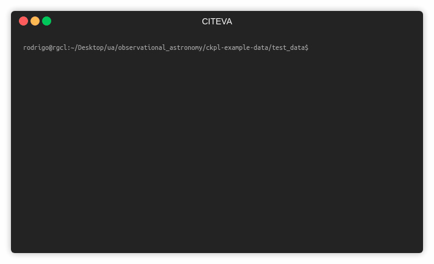

Ckoirama Pipeline
=================

> Status: First version released

This pipeline was developed exclusively to process the files coming off the Ckoirama Observatory of the Universidad 
de Antofagasta.

> The software is contained as PIP package, and the dependencies are solved automatically.

Installation
----------------

1) Install ckpl using pip

```
pip install ckpl
```

2) Install astrometry.net

```
sudo apt-get install astrometry.net
sudo apt-get install astrometry-data-2mass-07
```

Usage
-----



Ckoirama Observatory have one telescope called 
[Chakana](http://www.astro.uantof.cl/research/observatorios/ckoirama-observatory/). The out coming files are 
stored in the *Pelota PC*, usually in a directory that follow this pattern: `YYYY-MM-DD`.

Using the default options, the usage is as simple as run the command: `ckpl <working_directory>`. In this case, is expected
that all the calibration and science images are inside that directory.

As result, a new folder `out` will be created inside that directory.

You can download sample images in the following [link](https://drive.google.com/file/d/1Ke4t9SCI7Iy8PuXCqveed31H-bx4P-94/view?usp=sharing).


## Usage step by step

This pipeline can also be used by steps, that is:

1. `ckpl-ls`: This print in the terminal an astropy table with the data as is recognized by the program.
Also save that table in the directory.
```
Usage: ckpl-ls [OPTIONS] [IMDIR]

Options:
  -o, --output PATH  The name of the file to save the table
  -v, --verbose
  --nosave
  --help             Show this message and exit.
```

2. `ckpl-red`: This read the table data and make the reduction of the files, correcting
the science images by bias, dark and flat filters if are presented. As a result, an Astropy table is created, with 
the information of the reduced files.
```
Usage: ckpl-red [OPTIONS] [OUTDIR]

Options:
  -v, --verbose
  -r, --rawtable PATH
  --help               Show this message and exit.
```

3. `ckpl-ast`: This command read the table returned in the previous step and
perform the astrometry. A new files are created with the astrometrical parameters. Blind option means that the command 
perform a blind astrometry. 
```
Usage: ckpl-ast [OPTIONS] [OUTDIR]

Options:
  -r, --reducedtable PATH
  --blind                  Do blind Astrometry?
  --help                   Show this message and exit.

```

How it works
------------

1. Preprocessing: All the images are classified according to their fits header in: Bias, Dark, Flats, Filter, Light.

2. Reduction: The Master Bias, Dark, and Flats per filter are created. Light images are corrected by them.

3. Astrometry: Using astrometry.net the light images are astrometrically calibrated.

4. (In development) Staking: From the reduced table file, the program stack the images that match the stack column.


FAQ
----

1. What happen when some calibration file are missing?
 
If some calibration images are missing, the pipeline will just ignore them. For instance, if the working directory 
have not darks files, then the science images will be not corrected by dark images.

2. How to define how images are stacked?
You can edit the file returned by  `ckpl-red` command, setting the column `stack` with a common identifier.

3. What happen if the telescope lose its position?
 You can use the --blind flag in the `ckpl-ast` command to perform a blind search of the field. Then you
 can pass the coordinates of the center of the field to the TCS.
 
